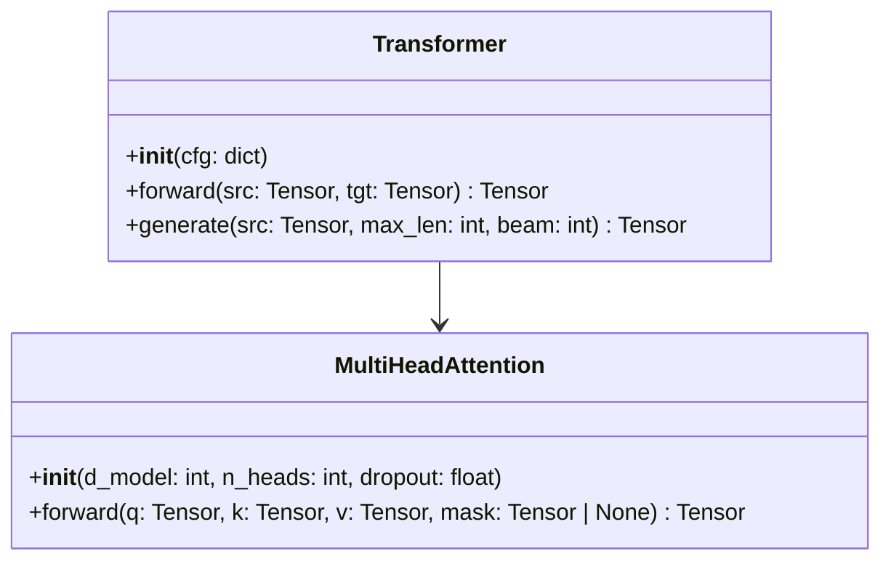
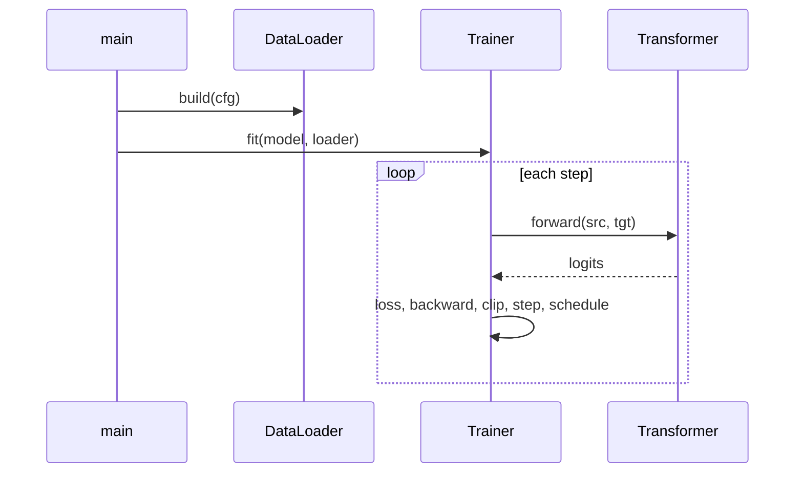

# Stage 2 — Design

**Goal:** decide the shape of the repository before any code exists, and freeze
the interfaces so that files written at different times still fit together.

**Reads:** `paper/paper.md`, `plan.md`.
**Writes:** `design.md`.

---

## Design for the smallest thing that reproduces the paper

The target is a repository a researcher can read in one sitting. Ten focused
files beat forty clever ones. Concretely:

- No plugin systems, no registries, no abstract base classes with one
  implementation, no dependency injection frameworks.
- Use the standard library of the ecosystem the paper lives in. If it is a deep
  learning paper, that means PyTorch and its `DataLoader`, not a bespoke
  training framework.
- One entry point (`main.py`) with subcommands, or a small set of scripts.
  Something must be runnable on the first `python` invocation.
- Abstraction is justified by the paper having multiple variants, not by
  imagining future ones.

## Write `design.md` with these sections

### 1. Implementation approach

A paragraph: the libraries chosen and why, how the paper's components map onto
modules, and the one or two design decisions that shape everything else (for
example: "the model is written framework-native rather than wrapping HuggingFace,
because the paper modifies attention internals").

### 2. File list

Every file with a one-line responsibility. Include configs, the smoke config,
and tests.

```
model/attention.py     Scaled dot-product and multi-head attention (§3.2)
model/transformer.py   Encoder, decoder, full model assembly (§3.1)
data/wmt.py            WMT14 loading, BPE, batching by token count (§5.1)
data/synthetic.py      Copy-task generator for the smoke path
train.py               Training loop, LR schedule, checkpointing (§5.3)
evaluate.py            Beam search decoding and BLEU (§6.1)
config.yaml            Base configuration
configs/smoke.yaml     One-minute CPU configuration
main.py                CLI entry point
tests/test_shapes.py   Shape and gradient-flow checks
```

### 3. Interfaces (frozen)

The contract every later stage must honour, given as a class diagram plus
explicit signatures. Once written, this does not change without a note in
`notes.md` explaining why.



For every public function, state the **tensor shape contract** — input shapes,
output shape, dtype, device assumptions:

```
MultiHeadAttention.forward
  q, k, v : [B, T, d_model] float32
  mask    : [B, 1, T, T] bool or None, True = keep
  returns : [B, T, d_model] float32
```

Shape contracts written here are the single most effective defence against the
failure mode where each file is individually plausible and the assembly does
not run.

### 4. Call flow

A sequence diagram of one training step and one evaluation pass, using the
classes and methods defined above.



### 5. Configuration surface

The top-level keys of `config.yaml` and what each governs. Stage 4 fills in the
values; here you decide the structure.

### 6. Dependencies

Direct dependencies with pinned major versions and a one-line justification
each. Prefer fewer. If the paper predates a library you plan to use, say how
you will keep behaviour equivalent.

### 7. What this design deliberately omits

Distributed training, mixed precision, logging backends, checkpointable
dataloaders — whatever a production system would have and a reproduction does
not need. Naming the omissions stops them from being reintroduced later.

---

Update `STATE.md` and report the file list and the frozen interfaces.
